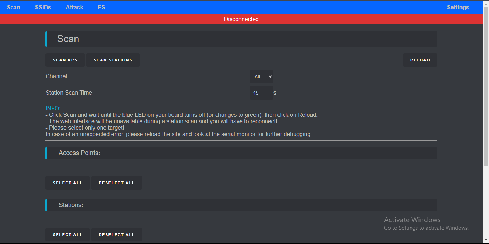
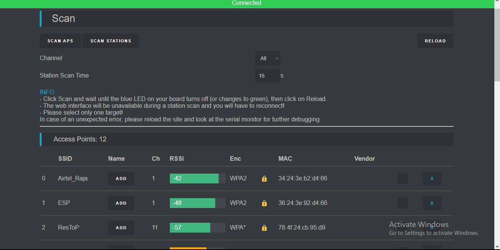
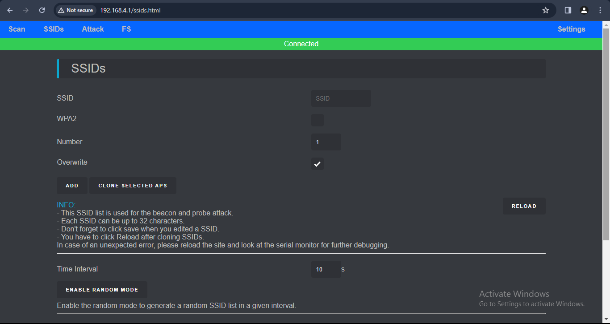
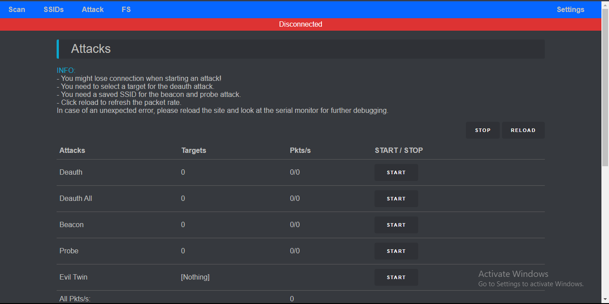
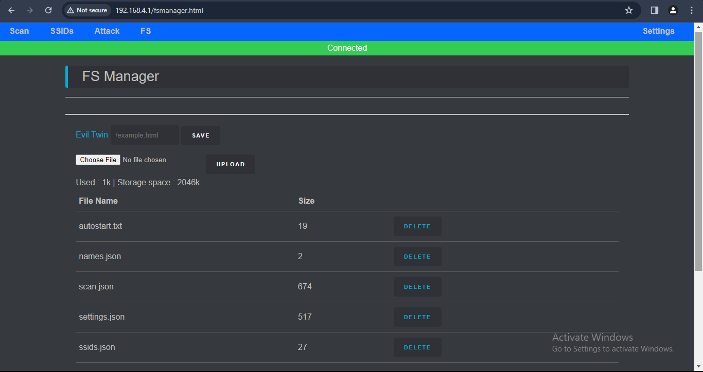
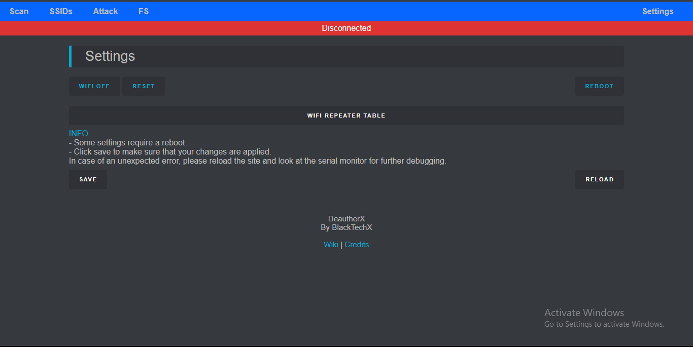
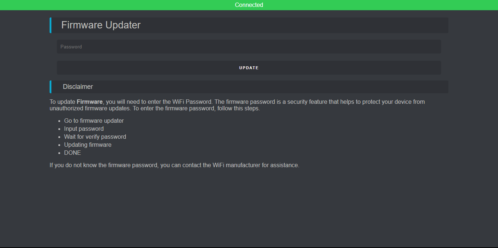

# DeautherX
An ESP8266_Deauther with Evil Twin attack which can be modified using web interface! and I have added more feature like flash light 
- For more information visit https://github.com/BlackTechX011/DeautherX.INFO


# About Deauther
This firmware allows you to easily perform a variety of actions to test 802.11 networks using an ESP8266. It's also a great project for learning about WiFi, microcontrollers, Arduino, hacking and electronics/programming in general.
The deauthentication attack is the main feature, which can be used to disconnect devices from their WiFi network.
Although this denial-of-service attack is nothing new, a lot of devices are still vulnerable to it. Luckily this is slowly changing with more WiFi 6 enabled devices being used. But a lot of outdated WiFi devices remain in place, for example in cheap IoT hardware. With an ESP8266 Deauther, you can easily test this attack on your 2.4GHz WiFi network/devices and see whether it's successful or not. And if it is, you know you should upgrade your network.


# DISCLAIMER
This project is a proof of concept for testing and educational purposes.
*If u did any illegal activity with this project we are not responsble.*
Neither the ESP8266, nor its SDK was meant or built for such purposes. Bugs can occur!

Use it only against your own networks and devices!
Please check the legal regulations in your country before using it.
We don't take any responsibility for what you do with this program.


# Installation (.bin)

- Get a .bin file for your board from https://github.com/BlackTechX011/DeautherX
- Open ESP flasher tools
- Connect your ESP8266 board via USB
- Click Connect and select the serial port of your ESP
- Select your Deauther .bin file
- Click Program

This Deauther is based on SpacehuhnTech esp8266_deauther so the installation is same for both project. for more information visit https://github.com/SpacehuhnTech/esp8266_deauther/wiki/Installation#flashing-the-firmware-bin-file
#### drivers for your device:

- CH340/CH341 Drivers: http://www.wch-ic.com/downloads/CH341SER_ZIP.html
- CP210x Drivers: https://www.silabs.com/developers/usb-to-uart-bridge-vcp-drivers
- FTDI Drivers: https://ftdichip.com/drivers/


# Display & Button Setup
## Before you continue
Using the display interface is entirely optional. You can also control the Deauther via serial or the web interface.

We cannot start at 0 for this tutorial, so if you find this too tricky, get an Arduino starter kit with good documentation to get a feeling for tinkering with electronics. 😊

I focused on the NodeMCU in this tutorial since it is one of the most popular dev-boards. But every other ESP8266-based board should work just the same.
### - Wire components accordingly -
#### Display
```
  GND           | GND
  VCC/VDD/VCC   | 3.3V
  SCL/CLK/SCK   | GPIO 5 (D1)
  SDA           | GPIO 4 (D2)
```
#### Button
```
  UP            | GPIO 14 (D5)
  Down          | GPIO 12 (D6)
  A	        | GPIO 13 (D7)
  B             | GPIO 2  (D4)
```
#### NEOPIXEL LED
```
  GND	        | GND
  VCC           | VCC/3.3V
  DIN           | GPIO 16 (D0)
```
#### Light(Flash Light)
```
  GND	        | GND
  VCC           | GPIO 15 (D8)
```

# Web Interface
To access the web interface, your Deauther must be running, and you have to be connected to its WiFi network ```DeautherX``` using the password ```BlackTechX```

Then open your browser and visit ```192.168.4.1```. Make sure you're not connected to a *VPN* or anything else that could get in the way. You have to temporarily disable the mobile connection on some phones to make it work.

If you can't see a DeautherX network, give it some time like 10-5s to start the server if it do not work, ensure ESP8266 Deauther firmware was successfully installed. If it do not solve The issue report to **github issues page**, we will help you.
## Home
  


 
**DeautherX Home Page**

## Scan Page
  


On the scan page, you can discover access points (WiFi networks) and stations (client devices) nearby. If the access point list is empty, click on SCAN APS.

A scan takes a few seconds (usually 2 - 5 seconds). Depending on your board, you might see a LED turning on when starting the scan. As soon as the scan is finished, it turns off, signaling you to click on RELOAD to see the scan results.

 

Once you have a list of the access points, you can select them for an attack. But make sure only to select your own networks. Attacking other people's networks on purpose is strictly prohibited!

You can select multiple targets, but it's recommended to select only a single one for stability and performance reasons.

You can also scan for stations to select a specific client rather than an entire network. While a station scan is running, the web interface will be unavailable. You have to wait until it's finished and then reconnect.

## SSID Page
 
Deauther SSID Page

This is where you can add, edit and remove SSIDs. An SSID (Service Set Identifier) is the name of a WiFi network. They are used in beacon and probe attacks.


## Attack Page
  
Deauther Attack Page

On the attack page, you start and stop WiFi attacks such as Deauthentication, Beacon, Probe, and Evil Twin.

You may lose connection to the web interface when initiating an attack, but if you only select one target, you may be able to reconnect to it without problems. Attacks stop after 5 minutes by default. This is intended behavior to prevent abuse.

The pkts/s info is not automatically refreshed to save resources. You have to manually click RELOAD.

## FileManager (FS) page
 

on The FS page You can uplode your constom Evil Twin page. 
and you can also uplode multiple HTML Files for Evil Twin but, at a time you can only use HTML file for Evil Twin.

## Settings Page
 

You can edit device settings here, such as the SSID and password of Deauther's network. But make sure to hit SAVE after changing something and click on RELOAD to refresh the site and check whether or not your changes were applied.

## Errors
When using this tool, a thing to keep in mind is that the ESP8266 Deauther project was a proof of concept that became a popular tool for beginners to learn about WiFi hacking.

It's not a professional tool. It's free and open source. So please understand that:

The web interface is sometimes unstable and creates errors.
You will lose connection to the Deauther when starting a scan or an attack.
The attacks are meant for testing. They are not guaranteed to work. Learn more here.
The amount of networks and devices you are able to pick up and attack is limited by a variety of external factors, including but not limited to the transmit power of such a small device and its antenna.


# Setup Evil Twin

To use Evil Twin attack
- Open Deauther's web Interface panel
- Go to FileManeger (FS) Page
- Click On **Choose File** Button
- Sclect your Evil Twin HTML file. I have provided you the basic HTML file for Evil Twin attack you can uplode that.
- Then click Uplode Button 
- Now on "Evil Twin /example.html" Enter your file name like this /File_Name.html.
- And Now click "Save" Button.
You are done now u can use EvilTwin attack.

#### Example of EvilTwin Attack


# DISCLAIMER
This project is a proof of concept for testing and educational purposes.
*If u did any illegal activity with this project we are not responsble.*
Neither the ESP8266, nor its SDK was meant or built for such purposes. Bugs can occur!
